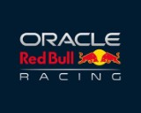

# 🏎️ Formula 1 Logo BMPs for Baofeng UV-5RH Series

Custom **Formula 1 splash screen images** for select Baofeng handheld radios.  
Show off your team pride every time you boot up your radio — because comms should be as iconic as a Monaco overtake.

---

## 📻 Supported Radios

These BMPs are designed specifically for the following Baofeng models:

- **UV-5RH**
- **UV-17**
- **UV-18**
- **UV-19**
- **UV-20**
- **UV-21**

They are **not compatible** with UV-5R, UV-82, or other models using different chipsets or screen formats.

> 🎯 These radios support logo flashing via the official **Baofeng CPS software**, available here:  
> 🔗 https://www.baofengradio.co.uk/software/

---

## 🖼️ What's Included

- **160×128** BMPs of:
  - The official **Formula 1 logo**
  - Popular teams (2025 season):
    - Ferrari
    - Red Bull Racing
    - *(More coming soon!)*

All images are optimized for clarity and high contrast on low-resolution LCDs.

---

## 🔧 How to Flash a Logo

Flashing a custom logo is super easy and doesn’t require downloading anything from your radio.

### Steps:

1. 📥 Download and install the [Baofeng CPS software](https://www.baofengradio.co.uk/software/)  
   → Be sure to select the **UV-5RH** version
2. 🔌 Connect your radio to your PC via a Baofeng-compatible programming cable
3. 🧭 In CPS, go to:  
   `Tools` → `Power On Picture`
4. 📡 Select the correct **COM port**
5. 🖼️ Click **Import Image**, then choose a BMP from this repo
6. 🚀 Click **Import** to flash the logo
7. 🔄 Turn your radio off and back on to enjoy the drip

> 💡 **Tip:** If the image doesn’t appear and your radio keeps the default splash, try re-importing the BMP or double-checking the image size and format.

---

## 👀 Previews (More to come...)

| Team      | Preview                        |
|-----------|--------------------------------|
| F1 Logo   |          |
| Ferrari   |   |
| Red Bull  |  |
| McLaren   |   |

Preview images are located in the `Previews/` folder.  
Note: actual splash screen output may vary slightly depending on LCD contrast.

---

## 🤝 Contributing

Have a team request? Want to add Haas for the memes?  
Open a pull request or issue — just follow these guidelines:

- Must be **160×128 pixels**
- Must be in **BMP format**
- Should look good on a low-res screen (high contrast preferred)

---

## ⚠️ Disclaimer

This is an **unofficial fan-made project**.  
All logos are trademarks of their respective teams and Formula 1.  
This is for personal, non-commercial use only.

---

Made by a radio nerd who thinks team radio should come with *actual* team logos. 🏆
